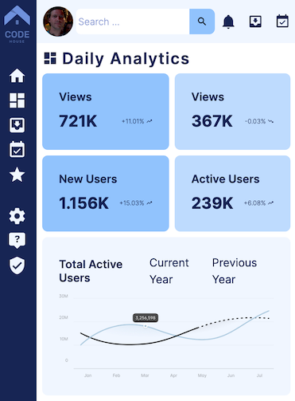

# Admin Dashboard

<p align="center">
  <a href="#overview">Overview</a> •
  <a href="#what-i-learned">What I learned</a> •
  <a href="#useful-resources">Useful Resources</a> •
  <a href="#contact">Contact</a>
</p>

## Overview 

The purpose of this project was to demonstrate mastery of **CSS Grid** by building a full admin dashboard layout. 

I started by looking at existing admin dashboards from competitors such as Clickup and Monday Morning. I then did a wireframe in Figma before stating on the markup and styling.

### Outcomes

- Used HTML5 **semantic elements** for better readability and structure
- Used CSS3 **grid** and **flex** to manage layouts
- Used **Git** and **GitHub** for project management
- Responsive for both Desktop & Mobile

### Desktop Preview


### Mobile Preview


### Live Version
**[Admin Dashboard](https://ryanthayes.github.io/top-admin-dashboard/)**

### Built With

       

## What I learned

I learned about :not(:placeholder-shown) to highlight the search box input field when the user selects. I also learned how to position the submit button inside of the input field.``

```CSS
.dashboard-search-input {
    position: relative;
    padding: var(--spacer-sm);
    height: 2rem;
    font-size: var(--fs-300);
    font-weight: var(--fw-light);
    color: var(--clr-primary-800);
    outline: none;
    border: none;
    border-radius: var(--br-sm);
}

.btn-search {
    position: absolute;
    top: 0;
    right: 0;
    cursor: pointer;
    height: 2rem;
    width: 2rem;
    background-color: var(--clr-primary-300);
    border: none;
    border-top-right-radius: var(--br-sm);
    border-bottom-right-radius: var(--br-sm);
    z-index: 1;
}

.dashboard-search-input:not(:placeholder-shown) {
    border: 1px solid var(--clr-primary-200);
}
```

## Useful resources

- [Complete CSS Grid Tutorial with Cheat Sheet](https://www.freecodecamp.org/news/css-grid-tutorial-with-cheatsheet/#the-justify-items-property)
- [Material Design Icons via Iconify.design](https://iconify.design)

## Acknowledgements

[Logo courtesy of freepik](https://www.freepik.com/free-vector/flat-design-programming-company-logo-templates_11827530.htm#query=ux%20logo&position=20&from_view=keyword&track=ais)
[Charts courtesy of ByeWind](https://www.figma.com/community/file/1210542873091115123/dashboard-ui-kit-dashboard)

## Contact

[](https://www.linkedin.com/in/ryan-t-hayes/)
