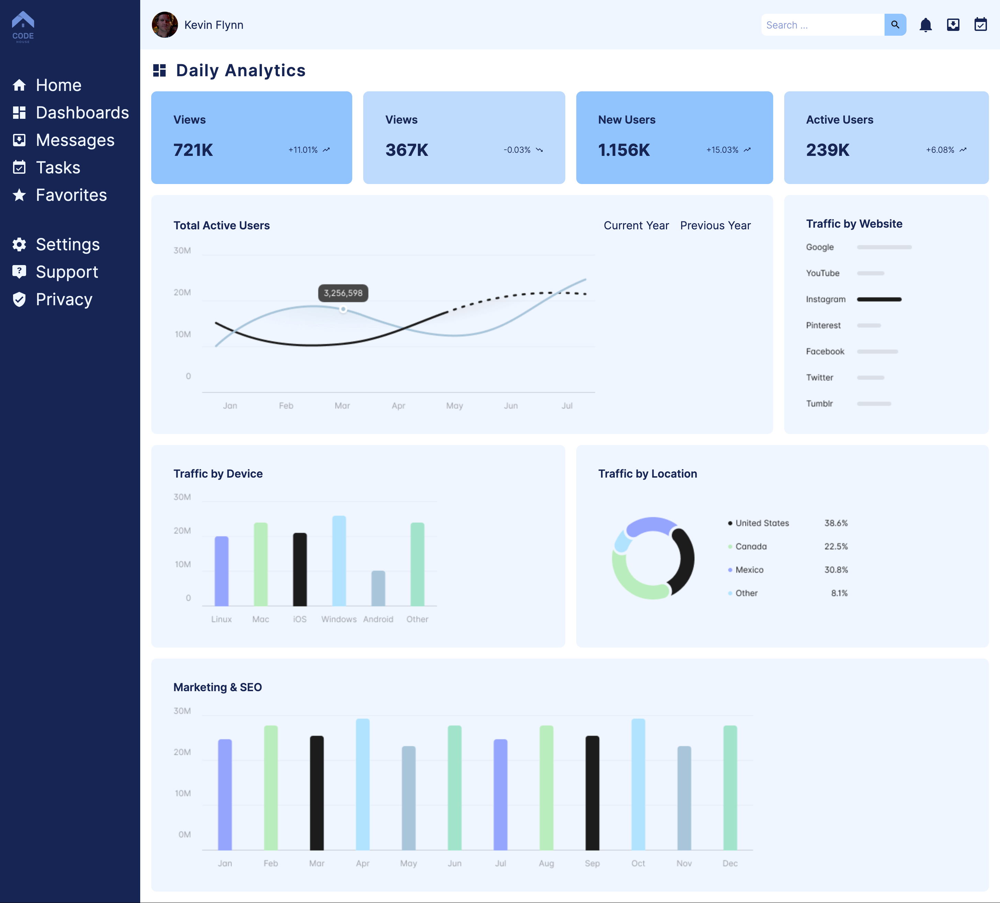

# The Odin Project - Admin Dashboard

## Table of contents

- [Overview](#overview)
  - [The goal](#the-goal)
  - [Preview](#preview)
  - [Live Site](#live-site)
- [My process](#my-process)
  - [Built with](#built-with)
  - [Features](#features)
  - [Outcome](#outcome)
  - [What I learned](#what-i-learned)
  - [Continued development](#continued-development)
  - [Proud of](#proud-of)
  - [Useful resources](#useful-resources)
  - [Acknowledgements](#acknowledgements)
- [Author](#author)

### The goal 

The goal of the project was to demonstrate master of CSS grid by building a full admin dashboard design. 

### Preview

### Live set

[Admin Dashboard](https://ryanthayes.github.io/top-admin-dashboard/)

## My process

### Built With

   

### Features

- Responsive for both Desktop & Mobile
- Used **Material Design Icons** for UI

### Outcome

- Used HTML5 **semantic elements** for better readability and structure
- Used CSS3 **grid** and **flex** to manage layout
- Used **Git** and **GitHub** for project management
- **Cross tested** on Firefox and Chromium based browsers

### What I learned

- Use of **CSS Grid Functions** such as clamp to optimally size elements for different sized device screens.

### Proud of

### Useful resources

- [Complete CSS Grid Tutorial with Cheat Sheet](https://www.freecodecamp.org/news/css-grid-tutorial-with-cheatsheet/#the-justify-items-property)
- [Material Design Icons via Iconify.design](https://iconify.design)

### Acknowledgements

[Logo courtesy of](https://www.freepik.com/free-vector/flat-design-programming-company-logo-templates_11827530.htm#query=ux%20logo&position=20&from_view=keyword&track=ais)

## Author

